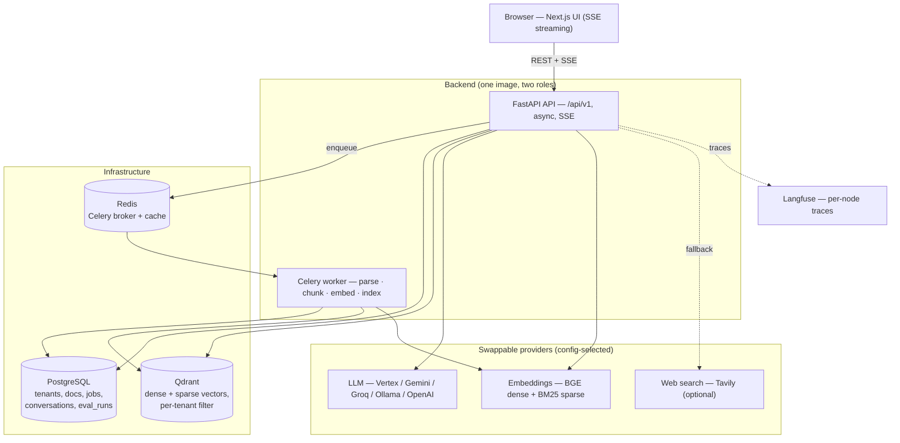

# Sourcebound

**Ask questions against your internal docs and code, and get answers with citations
back to the source — every claim traceable, or it doesn't ship.**

Sourcebound is a citation-grounded KnowledgeOps RAG platform. You connect your
internal documents; you ask a question; you get a streamed answer where **every
claim links to the chunk it came from**. The engine grades its own retrieval,
rewrites the query when retrieval is weak, falls back to web search when its own
corpus comes up short, and verifies the answer is grounded before returning it.

> The non-negotiable invariant: **an uncited claim is a bug, not a feature.**

---

## The problem

Plain RAG (`retrieve → stuff into prompt → generate`) has one fatal failure mode:
when retrieval returns irrelevant context, it generates anyway — fluently, and
ungrounded. For an internal knowledge base that's worse than useless: a confident,
plausible, *wrong* answer with no way to check it. The hard part isn't calling an
LLM; it's making the system **notice when it doesn't know**, recover when it can,
and prove where every sentence came from when it does answer.

Sourcebound solves this with a **corrective (agentic) RAG** engine: a state machine
that self-grades, self-corrects with bounded retries, degrades gracefully, and
attaches provenance end-to-end (chunk → service → API → UI).

---

## What's inside

- **Corrective-RAG query engine** — grade → rewrite-loop → web fallback → generate →
  verify-grounding, as a LangGraph state machine (not an opaque chain).
- **Hybrid retrieval + rerank** — dense (BGE) + sparse (BM25) fused with weighted
  RRF, then a cross-encoder reranker for a precise top-`k`.
- **Citations as a first-class output** — answers carry `source_uri`, `chunk_id`,
  and a snippet for each citation; web-sourced facts are flagged as external.
- **Streaming UI** — Next.js (App Router, JS/JSX) streaming tokens over SSE, with a
  grounding score and "self-corrected / used-web" indicators.
- **Async ingestion** — upload returns immediately; a Celery worker parses, chunks,
  embeds (dense + sparse), and indexes off the request path.
- **Multi-tenant by construction** — `tenant_id` is a required retrieval argument and
  a Qdrant payload filter; no code path can read another tenant's data.
- **Provider-agnostic models** — swap Vertex / Gemini / Groq / Ollama / OpenAI by
  config; open BGE embeddings run locally for free.
- **Built-in evaluation** — a golden-dataset harness with an LLM-as-judge, gated in
  CI on a configurable faithfulness threshold.
- **Observability** — per-node Langfuse traces (cost + latency), structured JSON
  logs with correlation ids, a consistent error envelope.

---

## Architecture

One backend image runs as both the API and the Celery worker, in front of Postgres
(facts), Qdrant (vectors), and Redis (broker), with swappable model providers.



Deeper diagrams (ingestion vs. ask sequence flows, retrieval internals, tenancy)
are in [`docs/architecture.md`](docs/architecture.md).

---

## The corrective-RAG graph

The query engine loops and branches — that's why it's a graph, not a chain. The
only cycle (`retrieve → grade → rewrite → retrieve`) is bounded by a retry cap, so
it always terminates.


| Node | Role |
|---|---|
| `retrieve` | Hybrid (dense+sparse) recall → cross-encoder rerank to top-`k` |
| `grade_documents` | One batched LLM call keeps only relevant chunks (**fail-open** on parse error) |
| `rewrite_query` | Intent-preserving reformulation; increments the retry guard |
| `web_search` | Last-resort public-web fallback; results cited as external URLs |
| `generate` | Grounded, cited answer, streamed token-by-token |
| `verify_grounding` | LLM rates how grounded the answer is (0–1), surfaced to the UI |

---

## Results: naive vs. corrective

Measured by the eval harness (`backend/eval/`) over the 15-question golden dataset
(`eval/golden.jsonl`), comparing the `naive` preset (dense-only, no rerank, no
corrective loop) against the full `corrective` pipeline (hybrid + rerank + grade +
rewrite-loop). Reproduce with:

```bash
cd backend && python eval/run_eval.py --compare naive corrective
```

| Metric | Naive (dense only) | Corrective (hybrid + rerank + loop) | Δ |
|---|---|---|---|
| `faithfulness` | 0.97 | 0.97 | +0.00 |
| `answer_relevancy` | 1.00 | 1.00 | +0.00 |
| `context_precision` | 0.97 | 0.93 | −0.03 |
| `context_recall` | 1.00 | 1.00 | +0.00 |

*Run with `LLM_PROVIDER=vertex`, `gemini-2.5-pro` as both generator and judge,
2026-06-27. Aggregate means over 15 questions.*

**Reading this honestly:** on this golden set the two configs are a tie — naive
dense retrieval already hits 0.97 faithfulness and perfect recall, because every
question is directly answerable from the corpus. The corrective machinery (rewrite
loop, web fallback) **never needed to fire** here — every question retrieved
relevant context on the first pass — so the comparison mostly isolates *hybrid +
rerank* vs *dense*, which trades a hair of precision (more lexical matches beyond
the labelled ideal sources) for the same recall and faithfulness. The corrective
engine's value is **robustness on queries this small set doesn't stress** — when
first-pass retrieval *is* weak, the loop and fallback are what keep an answer
grounded instead of hallucinated, and the verify node (which scored grounding 1.0
across this set) is what proves it. A larger, harder golden set is the right way to
quantify that; the harness and presets are built for it.

> Retrieval metrics (`context_precision` / `context_recall`) are computed
> deterministically from the golden `ideal_sources`; generation metrics
> (`faithfulness` / `answer_relevancy`) use an LLM-as-judge. See
> [`docs/architecture.md §7`](docs/architecture.md) for the methodology.

---

## Run it locally — one command

```bash
# Prereq: create backend/.env (see backend/.env.example) — set JWT_SECRET and one
# LLM provider (e.g. LLM_PROVIDER=groq + GROQ_API_KEY).
docker compose up --build -d
```

Brings up **api + worker + frontend + postgres + qdrant + redis + langfuse** (a
one-shot Alembic `migrate` job runs first). Then:

- Frontend → http://localhost:3000
- API + docs → http://localhost:8000/docs
- Langfuse → http://localhost:3001

Stop / reset: `docker compose down` (keeps data) · `docker compose down -v` (wipes
volumes). Full env-var reference and local (non-Docker) dev setup are in
[`CLAUDE.md §8`](CLAUDE.md).

---

## Tech decisions & trade-offs

Short version (full ADRs with alternatives in [`docs/decisions.md`](docs/decisions.md)):

- **Corrective RAG over a linear chain** — a plain chain can't notice bad retrieval,
  so it hallucinates. The graph self-grades and self-corrects. *Trade-off:* more LLM
  calls per query (grade + optional rewrite + verify), accepted because a fast
  ungrounded answer is worthless when citations are the product.
- **Qdrant for vectors** — strong payload filtering (clean multi-tenancy), native
  dense+sparse, free self-hosting. *Trade-off:* one more stateful service vs folding
  vectors into Postgres with pgvector, accepted for the isolation + hybrid guarantees.
- **Hybrid retrieval + cross-encoder rerank** — an internal KB mixes prose and exact
  identifiers; dense alone blurs tokens, sparse alone misses paraphrase. RRF fusion
  gets both, the reranker makes the top-`k` precise. *Trade-off:* more moving parts
  and rerank latency; the reranker is swappable/downsizable via config.
- **Postgres for facts, Qdrant for vectors** — ACID system-of-record separate from
  ANN search; provenance is duplicated into the vector payload so citations travel
  with the chunk.
- **Provider-agnostic LLM/embeddings** — no vendor lock-in; run fully local for free
  or point at a hosted tier with a config change.
- **LLM-as-judge eval gated in CI** — answer-quality regressions fail the build;
  threshold is a repo variable. *Trade-off:* the judge has variance and token cost,
  mitigated with strict numeric prompts behind a swappable `Evaluator` interface.

---

## Project layout

```
backend/   FastAPI app, RAG graph, providers, Celery worker, eval harness, tests
frontend/  Next.js (App Router, JS/JSX) streaming UI
docs/      architecture.md · decisions.md · knowledgeops_research.md
docker-compose.yml   full stack in one command
```

The build contract and conventions for all work live in [`CLAUDE.md`](CLAUDE.md).
