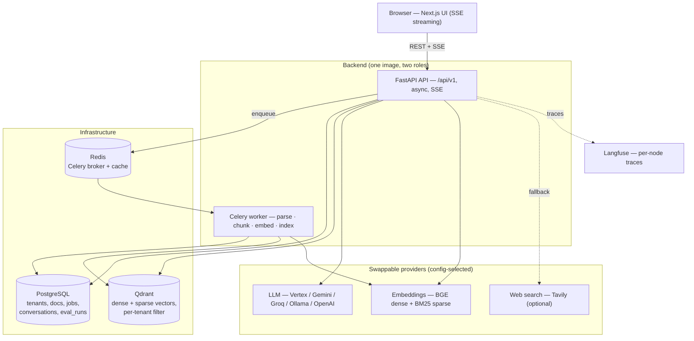
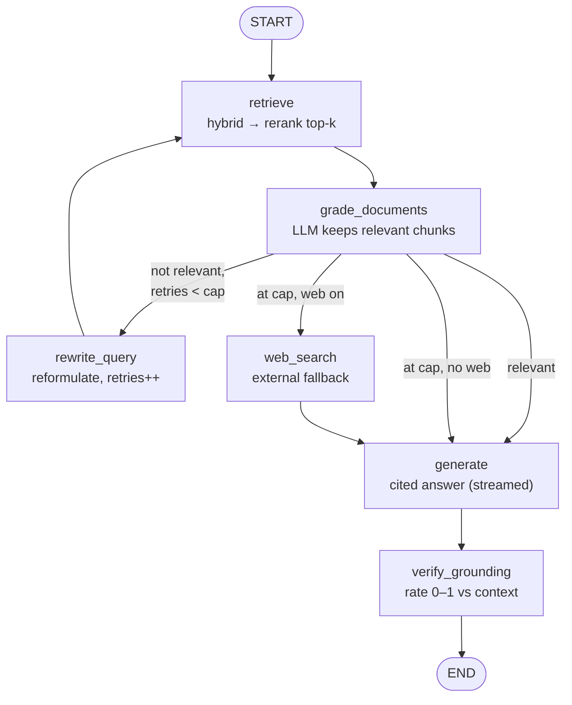

# Sourcebound

**Ask questions against your internal docs and code, and get answers with citations
back to the source — every claim traceable, or it doesn't ship.**

Sourcebound is a citation-grounded KnowledgeOps RAG platform. You connect your
internal documents; you ask a question; you get a streamed answer where **every
claim links to the chunk it came from**. The engine grades its own retrieval,
rewrites the query when retrieval is weak, falls back to web search when its own
corpus comes up short, and verifies the answer is grounded before returning it.

> The non-negotiable invariant: **an uncited claim is a bug, not a feature.**

---

## The problem

Plain RAG (`retrieve → stuff into prompt → generate`) has one fatal failure mode:
when retrieval returns irrelevant context, it generates anyway — fluently, and
ungrounded. For an internal knowledge base that's worse than useless: a confident,
plausible, *wrong* answer with no way to check it. The hard part isn't calling an
LLM; it's making the system **notice when it doesn't know**, recover when it can,
and prove where every sentence came from when it does answer.

Sourcebound solves this with a **corrective (agentic) RAG** engine: a state machine
that self-grades, self-corrects with bounded retries, degrades gracefully, and
attaches provenance end-to-end (chunk → service → API → UI).

---

## What's inside

- **Corrective-RAG query engine** — grade → rewrite-loop → web fallback → generate →
  verify-grounding, as a LangGraph state machine (not an opaque chain).
- **Hybrid retrieval + rerank** — dense (BGE) + sparse (BM25) fused with weighted
  RRF, then a cross-encoder reranker for a precise top-`k`.
- **Citations as a first-class output** — answers carry `source_uri`, `chunk_id`,
  and a snippet for each citation; web-sourced facts are flagged as external.
- **Streaming UI** — Next.js (App Router, JS/JSX) streaming tokens over SSE, with a
  grounding score and "self-corrected / used-web" indicators.
- **Async ingestion** — upload returns immediately; a Celery worker parses, chunks,
  embeds (dense + sparse), and indexes off the request path.
- **Multi-tenant by construction** — `tenant_id` is a required retrieval argument and
  a Qdrant payload filter; no code path can read another tenant's data.
- **Provider-agnostic models** — swap Vertex / Gemini / Groq / Ollama / OpenAI by
  config; open BGE embeddings run locally for free.
- **Built-in evaluation** — a golden-dataset harness with an LLM-as-judge, gated in
  CI on a configurable faithfulness threshold.
- **Observability** — per-node Langfuse traces (cost + latency), structured JSON
  logs with correlation ids, a consistent error envelope.

---

## Architecture

One backend image runs as both the API and the Celery worker, in front of Postgres
(facts), Qdrant (vectors), and Redis (broker), with swappable model providers.



Deeper diagrams (ingestion vs. ask sequence flows, retrieval internals, tenancy)
are in [`docs/architecture.md`](docs/architecture.md).

---

## The corrective-RAG graph

The query engine loops and branches — that's why it's a graph, not a chain. The
only cycle (`retrieve → grade → rewrite → retrieve`) is bounded by a retry cap, so
it always terminates.



| Node | Role |
|---|---|
| `retrieve` | Hybrid (dense+sparse) recall → cross-encoder rerank to top-`k` |
| `grade_documents` | One batched LLM call keeps only relevant chunks (**fail-open** on parse error) |
| `rewrite_query` | Intent-preserving reformulation; increments the retry guard |
| `web_search` | Last-resort public-web fallback; results cited as external URLs |
| `generate` | Grounded, cited answer, streamed token-by-token |
| `verify_grounding` | LLM rates how grounded the answer is (0–1), surfaced to the UI |

---

## Results: naive vs. corrective

Measured by the eval harness (`backend/eval/`) over a **30-question golden dataset
across 12 documents** (`eval/golden.jsonl`) — deliberately seeded with distractors
(three different "90-day" facts, three Slack channels, three error-rate thresholds,
a payments-vs-billing service split) so retrieval has to discriminate. It compares
the `naive` preset (dense-only, no rerank, no corrective loop) against the full
`corrective` pipeline (hybrid + cross-encoder rerank + grade + rewrite-loop).
Reproduce with:

```bash
cd backend && python eval/run_eval.py --compare naive corrective
```

| Metric | Naive (dense only) | Corrective (hybrid + rerank + loop) | Δ |
|---|---|---|---|
| `faithfulness` | 0.93 | 0.92 | −0.02 |
| `answer_relevancy` | 0.94 | 0.93 | −0.01 |
| `context_precision` | 0.77 | 0.73 | −0.04 |
| `context_recall` | 0.97 | 0.98 | +0.02 |

*`gemini-2.5-pro` as both generator and judge, 2026-06-28. Aggregate means over 30
questions; rerank ran with the lightweight `ms-marco-MiniLM-L-6-v2` cross-encoder
(the CI-weight model), not the production `bge-reranker-base`.*

**Reading this honestly — the aggregate hides the real signal.** On these metrics
corrective does **not** beat naive; it's a wash, slightly behind on precision. Two
things drive that, and both are findings worth stating plainly:

1. **There's a ceiling.** A strong LLM over high-recall retrieval already answers
   most questions correctly (recall ~0.97 for *both*), so there's little headroom
   for the corrective machinery to add measurable lift. Every exact-identifier
   question (`GATEWAY_TIMEOUT_MS`, `X-API-Key`, `BILLING_DB_URL`, …) scored
   precision 1.00 for both configs.
2. **Hybrid trades precision for recall when the reranker is weak.** Sparse/BM25
   surfaces lexically-similar distractor chunks ("Vault" also lives in the security
   doc, "deploys" in the staging doc); the lightweight CI reranker doesn't fully
   filter them, costing the −0.04 precision. The production `bge-reranker-base`
   is expected to recover this — an open item, not a closed result.

Where corrective **does** win is exactly what the metrics' means dilute — *trust on
the queries that should be hard*:

- **Refusing the unanswerable.** Asked a question with no answer in the corpus
  ("parental leave policy"), **naive hallucinated a policy** (faithfulness 0.00);
  corrective correctly declined (1.00). That is the whole point of the project.
- **Multi-hop** (answer spans two docs): precision 0.00 → 0.50.
- It recovered several single-fact answers naive got wrong.

So the corrective engine earns its cost as **robustness and groundedness
insurance**, not as a leaderboard number — and an honest benchmark says so. Closing
the precision gap with the full reranker, and weighting the eval toward
hard/unanswerable cases, are the clear next steps.

> Retrieval metrics (`context_precision` / `context_recall`) are computed
> deterministically from the golden `ideal_sources`; generation metrics
> (`faithfulness` / `answer_relevancy`) use an LLM-as-judge. See
> [`docs/architecture.md §7`](docs/architecture.md) for the methodology.

---

## Run it locally — one command

```bash
# Prereq: create backend/.env (see backend/.env.example) — set JWT_SECRET and one
# LLM provider (e.g. LLM_PROVIDER=groq + GROQ_API_KEY).
docker compose up --build -d
```

Brings up **api + worker + frontend + postgres + qdrant + redis + langfuse** (a
one-shot Alembic `migrate` job runs first). Then:

- Frontend → http://localhost:3000
- API + docs → http://localhost:8000/docs
- Langfuse → http://localhost:3001

Stop / reset: `docker compose down` (keeps data) · `docker compose down -v` (wipes
volumes). Full env-var reference and local (non-Docker) dev setup are in
[`CLAUDE.md §8`](CLAUDE.md).

---

## Tech decisions & trade-offs

Short version (full ADRs with alternatives in [`docs/decisions.md`](docs/decisions.md)):

- **Corrective RAG over a linear chain** — a plain chain can't notice bad retrieval,
  so it hallucinates. The graph self-grades and self-corrects. *Trade-off:* more LLM
  calls per query (grade + optional rewrite + verify), accepted because a fast
  ungrounded answer is worthless when citations are the product.
- **Qdrant for vectors** — strong payload filtering (clean multi-tenancy), native
  dense+sparse, free self-hosting. *Trade-off:* one more stateful service vs folding
  vectors into Postgres with pgvector, accepted for the isolation + hybrid guarantees.
- **Hybrid retrieval + cross-encoder rerank** — an internal KB mixes prose and exact
  identifiers; dense alone blurs tokens, sparse alone misses paraphrase. RRF fusion
  gets both, the reranker makes the top-`k` precise. *Trade-off:* more moving parts
  and rerank latency; the reranker is swappable/downsizable via config.
- **Postgres for facts, Qdrant for vectors** — ACID system-of-record separate from
  ANN search; provenance is duplicated into the vector payload so citations travel
  with the chunk.
- **Provider-agnostic LLM/embeddings** — no vendor lock-in; run fully local for free
  or point at a hosted tier with a config change.
- **LLM-as-judge eval gated in CI** — answer-quality regressions fail the build;
  threshold is a repo variable. *Trade-off:* the judge has variance and token cost,
  mitigated with strict numeric prompts behind a swappable `Evaluator` interface.

---

## Project layout

```
backend/   FastAPI app, RAG graph, providers, Celery worker, eval harness, tests
frontend/  Next.js (App Router, JS/JSX) streaming UI
docs/      architecture.md · decisions.md · knowledgeops_research.md
docker-compose.yml   full stack in one command
```

The build contract and conventions for all work live in [`CLAUDE.md`](CLAUDE.md).
