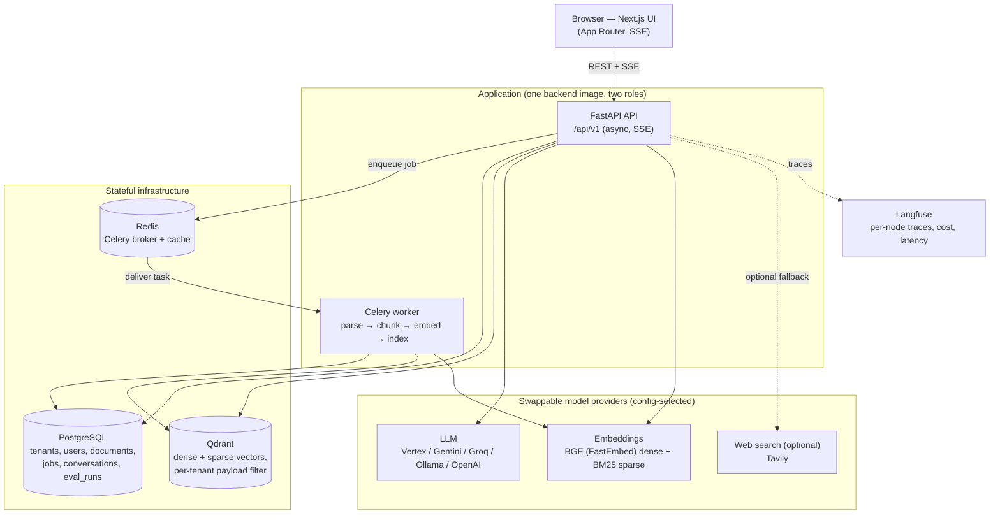
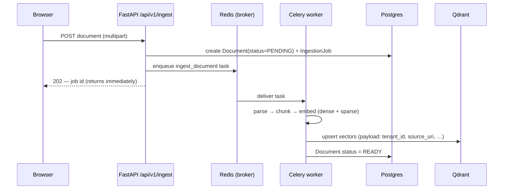
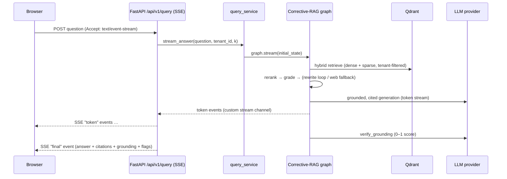
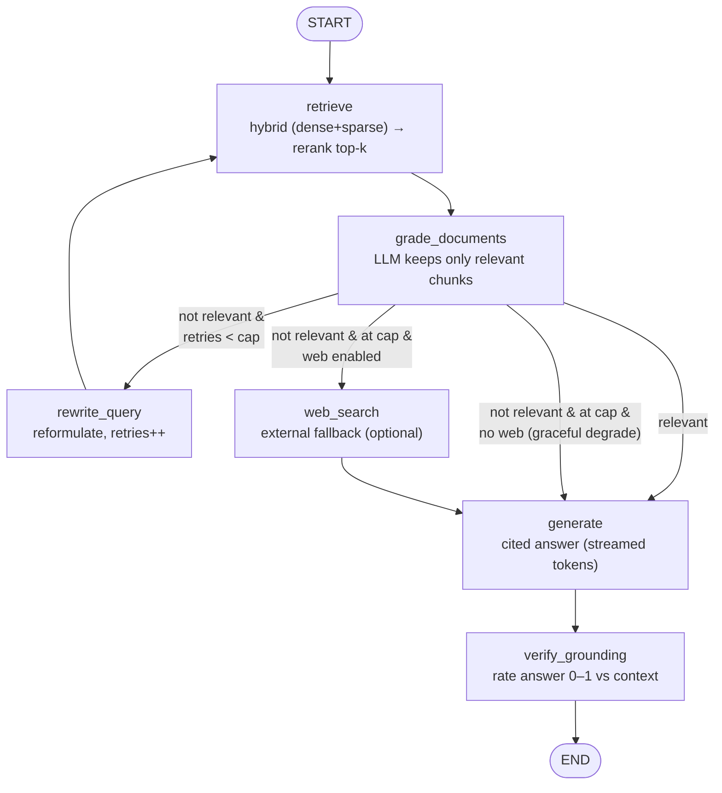

# Sourcebound — Architecture

This document is the deeper companion to the README. It covers the runtime
topology, the two request paths (ingest and ask), the corrective-RAG state
machine, and the multi-tenant isolation model. Every component below exists in
the codebase today — see the file pointers in each section.

---

## 1. Runtime topology

Sourcebound is a small set of stateless app processes in front of three data
stores and a set of swappable model providers. The API and the Celery worker run
the **same image** in different roles.



**Why the API and worker share one image:** ingestion (parse/chunk/embed) is
CPU-bound and slow, so it must never run on the request path. The worker imports
the same `app` package and runs `celery -A app.workers.celery_app worker`; the API
imports the same code and runs `uvicorn`. One build artifact, two commands — see
`backend/Dockerfile` and `docker-compose.yml`.

---

## 2. The two request paths

### 2.1 Ingestion (write path) — async, off the request thread



Files: `app/api/v1/routes/ingest.py` (thin), `app/services/ingestion_service.py`
(thick), `app/workers/tasks.py`, `app/rag/parsing.py`, `app/rag/chunking.py`,
`app/rag/providers/embeddings.py`, `app/vectorstore/qdrant.py`.

The file bytes ride in the Celery message (base64), so the worker needs no shared
filesystem with the API — only the same Redis broker (`app/workers/tasks.py`).

### 2.2 Ask (read path) — corrective RAG, streamed



Files: `app/api/v1/routes/query.py` (SSE envelope), `app/services/query_service.py`
(shapes `QueryResult` / streaming events), `app/graphs/`.

Both the streaming and non-streaming endpoints run the **same** compiled graph, so
they share identical corrective behavior and metadata (grounding score,
self-correction flag, web-fallback flag).

---

## 3. The corrective-RAG state machine

The query engine is a `langgraph` `StateGraph`, not a linear chain — because it
loops and branches. State is `QueryState` (`app/graphs/state.py`); nodes are in
`app/graphs/nodes.py`; wiring is `app/graphs/graph.py`.



Node-by-node:

| Node | What it does | Key behavior |
|---|---|---|
| `retrieve` | Hybrid retrieve top-N, then cross-encoder rerank to top-k | Per-request `k` arrives via `RunnableConfig`, kept out of persisted state |
| `grade_documents` | One **batched** LLM call returns the relevant chunk indices | **Fail-open**: on a parse failure it keeps all docs, so a flaky grader never silently drops a correct answer |
| `decide_after_grade` | Conditional edge | relevant → generate; else under cap → rewrite; else web (if configured) → else degrade |
| `rewrite_query` | Intent-preserving query reformulation, increments `retries` | `retries` (capped by `max_query_retries`) guarantees termination |
| `web_search` | Last-resort public-web fallback | Results become `documents` marked `external=True` (cited as URLs) |
| `generate` | Grounded, cited generation | Streams tokens through LangGraph's custom stream channel; emits the "insufficient context" answer when there are no docs |
| `verify_grounding` | LLM rates how grounded the answer is (0–1) | Surfaced to the UI; `None` when the model declared insufficiency |

**Why this terminates:** the only cycle is `retrieve → grade → rewrite → retrieve`,
and `rewrite_query` increments `retries`, which `decide_after_grade` checks against
`settings.max_query_retries`. Once the cap is hit, the graph either escapes to
`web_search` (if configured) or degrades to `generate` on best-available docs.

---

## 4. Retrieval internals

`app/rag/retrievers.py` exposes a `Retriever` protocol with three implementations,
selected by `settings.retriever_mode`:

- **Dense** — BGE cosine similarity; matches *meaning* ("how do I sign in" finds
  "authentication").
- **Sparse** — BM25 lexical; matches *exact tokens* (service names, env vars, error
  codes, function names that dense embeddings blur together).
- **Hybrid** — fuses both ranked lists with **weighted Reciprocal Rank Fusion**:
  `score(doc) = Σ_list weight / (rrf_k + rank)`. Weights, fusion constant, and
  prefetch depth are all configurable.

After fusion, a cross-encoder reranker (`app/rag/reranking.py`) re-scores the top
candidates and truncates to `k` — this is the precision step that fusion alone
doesn't give you.

---

## 5. Multi-tenant isolation

`tenant_id` is a **required** argument on `Retriever.retrieve` (no default) — there
is no code path that retrieves without a tenant filter, so one tenant can never
read another's vectors. The filter is applied in Qdrant as a payload filter
(`tenant_filter` in `app/vectorstore/qdrant.py`), and the same `tenant_id` is
stored on every Postgres row. Isolation is enforced at the data layer, not just in
application checks.

---

## 6. Observability

Langfuse is wired in `app/core/observability.py` and is **optional and non-fatal**:
if keys are missing or the backend is unreachable, the app still runs (observability
must never take down the API). Credentials are passed explicitly from validated
settings, and the client flushes on shutdown so no traces are lost. A LangChain
`CallbackHandler` is handed to the graph so each node (retrieve, grade, rewrite,
generate, verify) shows up as a span with cost and latency.

Structured JSON logs (`app/core/logging.py`) carry a correlation id; every error
returns the standard envelope `{ "error": { "code", "message", "details" } }`.

---

## 7. Evaluation harness

`backend/eval/` runs the compiled graph over a 15-question golden dataset
(`eval/golden.jsonl`) and scores four metrics, split by which half of the pipeline
they diagnose:

| Stage | Metric | How it's measured |
|---|---|---|
| Retrieval | `context_precision` | Deterministic — overlap of retrieved vs `ideal_sources` |
| Retrieval | `context_recall` | Deterministic — fraction of ideal sources retrieved |
| Generation | `faithfulness` | LLM-as-judge — is every claim supported by context? |
| Generation | `answer_relevancy` | LLM-as-judge — does the answer address the question? |

Retrieval metrics are deterministic (no judge bias); generation metrics use the
configured LLM as judge because "grounded" and "on-topic" need semantic judgement
(`eval/metrics.py`). Config **presets** (`naive`, `dense`, `hybrid`,
`hybrid_rerank`, `corrective`) let you isolate the effect of one stage at a time:

```bash
python eval/run_eval.py --compare naive corrective    # before/after table
python eval/run_eval.py --min-faithfulness 0.8        # CI gate
```

Each run is persisted to the `eval_runs` table; the faithfulness gate is enforced
in CI (`.github/workflows/ci.yml`) with a threshold configurable via the
`FAITHFULNESS_THRESHOLD` repo variable.
